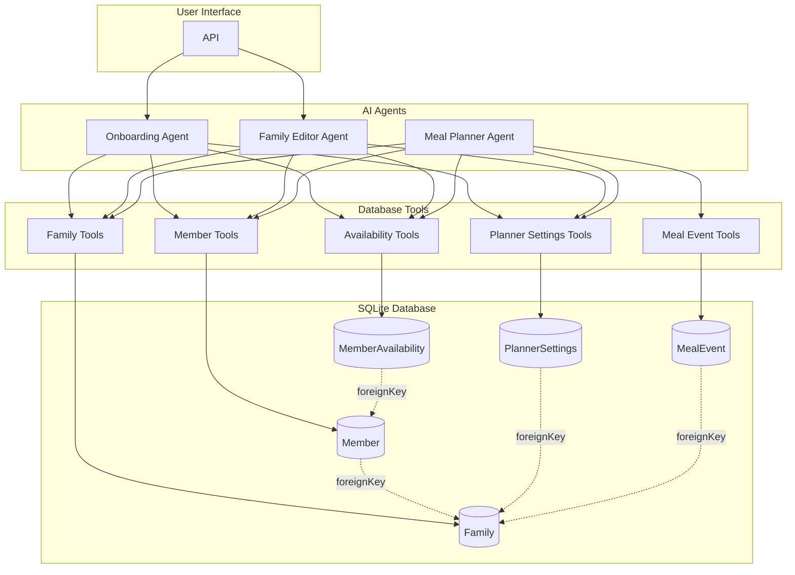

# Auguste - Architecture Overview

## System Architecture



## Project Structure

Auguste is organized as a **pnpm monorepo**.

```
.
├── apps/                             # Applications (future)
├── packages/
│   └── core/                         # Core package (@auguste/core)
│       ├── src/
│       │   ├── domain/               # Domain layer (data models & database)
│       │   │   ├── db/
│       │   │   │   ├── index.ts      # Drizzle client & connection
│       │   │   │   ├── schema.drizzle.ts # Drizzle ORM schema definition
│       │   │   │   ├── migrate.ts    # Migration runner
│       │   │   │   └── migrations/   # SQL migrations
│       │   │   └── schemas/
│       │   │       ├── index.ts      # Export all schemas
│       │   │       ├── enums.ts      # Type-safe enums
│       │   │       ├── family.schema.ts # Family & Member schemas
│       │   │       └── planner.schema.ts # PlannerSettings schemas
│       │   │
│       │   └── ai/                   # AI (Mastra) Layer
│       │       ├── index.ts          # Mastra instance
│       │       ├── tools/            # Database access tools
│       │       └── agents/           # AI agents
│       │
│       └── package.json              # Package manifest
│
├── specs/                            # Specifications & documentation
├── docs/                             # Additional guides
├── pnpm-workspace.yaml               # Workspace config
├── turbo.json                        # Turborepo config
└── package.json                      # Root manifest
```

## Agents

### Onboarding Agent (`onboarding-agent.ts`)

Handles the complete first-time setup flow:

- Family creation (name, country, language)
- Member registration (preferences, allergies, dietary restrictions)
- Planner settings (meal types, days, notifications)

### Family Editor Agent (`family-editor-agent.ts`)

Handles updates to an existing family configuration:

- Add/edit/remove family members
- Update family information
- Modify planner settings
- Change member availability

### Meal Planner Agent (`meal-planner-agent.ts`)

Handles the weekly meal planning process:

- Generates meal events for the next 7 days based on settings
- Suggests meals for each event based on preferences
- Validates and iteratively modifies the plan with the user

## Layer Responsibilities

### Domain Layer (`packages/core/src/domain/`)

- **Database**: SQLite connection, schema, and versioned migrations.
  - All migrations must use descriptive names: `pnpm run db:generate -- --name <feature>`.
- **Schemas**: Zod validation schemas, TypeScript types
- **Pure business logic**: No AI/agent dependencies

### Mastra Layer (`packages/core/src/ai/`)

- **Tools**: Database access tools for agents
- **Agents**: AI agents with prompts and tool bindings
