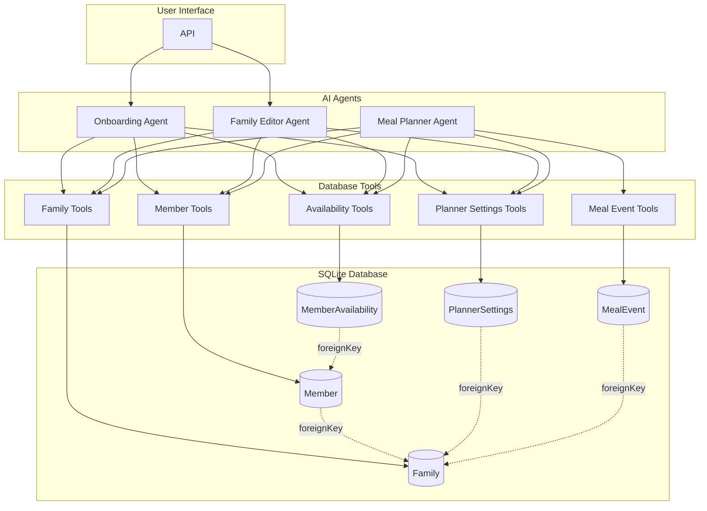

# Auguste - Architecture Overview

## System Architecture



## Project Structure

```
src/
├── domain/                           # Domain layer (data models & database)
│   ├── db/
│   │   └── index.ts                  # Database connection & utilities
│   └── schemas/
│       ├── index.ts                  # Export all schemas
│       ├── enums.ts                  # Type-safe enums
│       ├── family.schema.ts          # Family & Member schemas
│       └── planner.schema.ts         # PlannerSettings schemas
│
├── mastra/                           # Mastra AI layer
│   ├── index.ts                      # Mastra instance
│   ├── tools/
│   │   ├── index.ts                  # Export all tools
│   │   ├── family-tools.ts           # Family CRUD tools
│   │   ├── member-tools.ts           # Member CRUD tools
│   │   ├── availability-tools.ts     # Availability tools
│   │   └── planner-tools.ts          # PlannerSettings tools
│   └── agents/
│       ├── index.ts                  # Export all agents
│       ├── onboarding-agent.ts       # Full onboarding flow agent
│       └── family-editor-agent.ts    # Edit existing family agent
│
specs/                                # Specifications & documentation
├── architecture.md                   # This file
├── design-guidelines.md              # Visual identity & branding
├── database-schema.md                # Database design
├── data-models.md                    # TypeScript/Zod schemas
├── conversational-flow.md            # Agent conversation design
├── implementation-plan.md            # Development phases
└── TODO.md                           # Roadmap & known issues
```

## Agents

### Onboarding Agent (`onboarding-agent.ts`)

Handles the complete first-time setup flow:

- Family creation (name, country, language)
- Member registration (preferences, allergies, dietary restrictions)
- Planner settings (meal types, days, notifications)

### Family Editor Agent (`family-editor-agent.ts`)

Handles updates to an existing family configuration:

- Add/edit/remove family members
- Update family information
- Modify planner settings
- Change member availability

### Meal Planner Agent (`meal-planner-agent.ts`)

Handles the weekly meal planning process:

- Generates meal events for the next 7 days based on settings
- Suggests meals for each event based on preferences
- Validates and iteratively modifies the plan with the user

## Layer Responsibilities

### Domain Layer (`src/domain/`)

- **Database**: SQLite connection, schema, migrations
- **Schemas**: Zod validation schemas, TypeScript types
- **Pure business logic**: No AI/agent dependencies

### Mastra Layer (`src/mastra/`)

- **Tools**: Database access tools for agents
- **Agents**: AI agents with prompts and tool bindings
