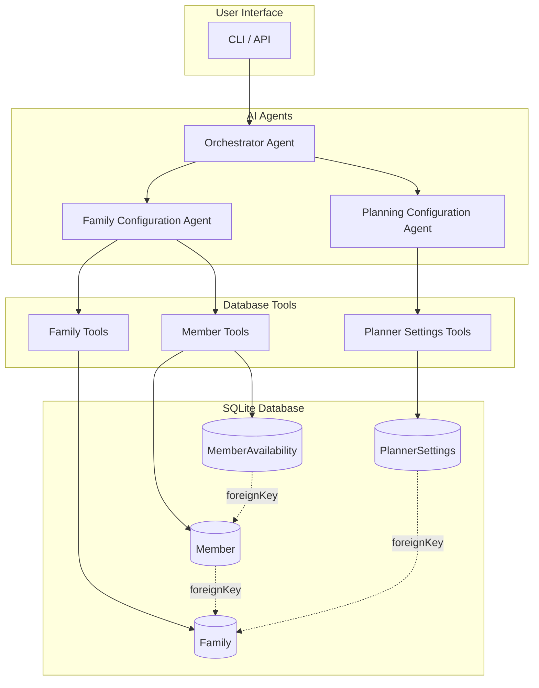

# Auguste - Architecture Overview

## System Architecture



## Project Structure

```
src/
├── domain/                           # Domain layer (data models & database)
│   ├── db/
│   │   ├── index.ts                  # Database connection & utilities
│   │   ├── schema.sql                # SQLite schema
│   │   └── migrations/               # Future migrations
│   └── schemas/
│       ├── index.ts                  # Export all schemas
│       ├── family.schema.ts          # Family & Member schemas
│       └── planner.schema.ts         # PlannerSettings schemas
│
├── mastra/                           # Mastra AI layer
│   ├── index.ts                      # Mastra instance
│   ├── tools/
│   │   ├── index.ts                  # Export all tools
│   │   ├── family-tools.ts           # Family CRUD tools
│   │   ├── member-tools.ts           # Member CRUD tools
│   │   ├── availability-tools.ts     # Availability tools
│   │   └── planner-tools.ts          # PlannerSettings tools
│   ├── agents/
│   │   ├── index.ts                  # Export all agents
│   │   ├── family-config-agent.ts    # Family configuration agent
│   │   ├── planner-config-agent.ts   # Planner configuration agent
│   │   └── init-orchestrator-agent.ts
│   ├── workflows/
│   │   ├── index.ts                  # Export all workflows
│   │   └── init-workflow.ts          # Init phase workflow
│   └── scorers/                      # (existing)
│
specs/                                # Specifications & documentation
├── architecture.md                   # This file
├── database-schema.md                # Database design
├── data-models.md                    # TypeScript/Zod schemas
├── conversational-flow.md            # Agent conversation design
└── implementation-plan.md            # Development phases
```

## Layer Responsibilities

### Domain Layer (`src/domain/`)
- **Database**: SQLite connection, schema, migrations
- **Schemas**: Zod validation schemas, TypeScript types
- **Pure business logic**: No AI/agent dependencies

### Mastra Layer (`src/mastra/`)
- **Tools**: Database access tools for agents
- **Agents**: AI agents with prompts and tool bindings
- **Workflows**: Multi-step agent orchestration
- **Scorers**: Evaluation metrics for agent responses

