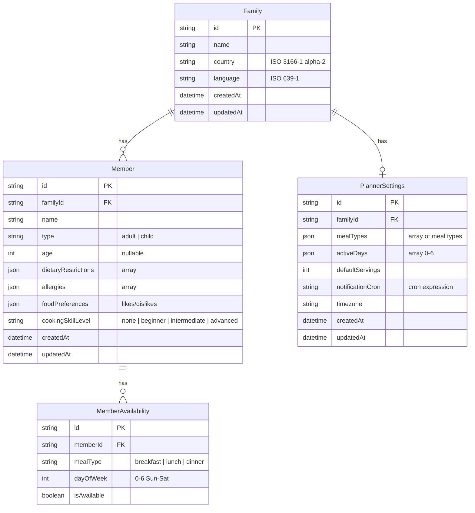

# Auguste - Database Schema

## Entity Relationship Diagram



## SQLite Schema

```sql
-- Family table: Represents a household
CREATE TABLE Family (
    id TEXT PRIMARY KEY,
    name TEXT NOT NULL,
    country TEXT NOT NULL,  -- ISO 3166-1 alpha-2 (e.g., 'US', 'FR')
    language TEXT NOT NULL, -- ISO 639-1 (e.g., 'en', 'fr')
    createdAt TEXT NOT NULL DEFAULT (datetime('now')),
    updatedAt TEXT NOT NULL DEFAULT (datetime('now'))
);

-- Member table: Individual family members
CREATE TABLE Member (
    id TEXT PRIMARY KEY,
    familyId TEXT NOT NULL,
    name TEXT NOT NULL,
    type TEXT NOT NULL CHECK (type IN ('adult', 'child')),
    age INTEGER,
    dietaryRestrictions TEXT DEFAULT '[]',
    allergies TEXT DEFAULT '[]',
    foodPreferences TEXT DEFAULT '{}',
    cookingSkillLevel TEXT DEFAULT 'none'
        CHECK (cookingSkillLevel IN ('none', 'beginner', 'intermediate', 'advanced')),
    createdAt TEXT NOT NULL DEFAULT (datetime('now')),
    updatedAt TEXT NOT NULL DEFAULT (datetime('now')),
    FOREIGN KEY (familyId) REFERENCES Family(id) ON DELETE CASCADE
);

-- MemberAvailability table: Which meals each member attends
CREATE TABLE MemberAvailability (
    id TEXT PRIMARY KEY,
    memberId TEXT NOT NULL,
    mealType TEXT NOT NULL CHECK (mealType IN ('breakfast', 'lunch', 'dinner')),
    dayOfWeek INTEGER NOT NULL CHECK (dayOfWeek >= 0 AND dayOfWeek <= 6),
    isAvailable INTEGER NOT NULL DEFAULT 1,
    FOREIGN KEY (memberId) REFERENCES Member(id) ON DELETE CASCADE,
    UNIQUE(memberId, mealType, dayOfWeek)
);

-- PlannerSettings table: Meal planning configuration
CREATE TABLE PlannerSettings (
    id TEXT PRIMARY KEY,
    familyId TEXT NOT NULL UNIQUE,
    mealTypes TEXT DEFAULT '["lunch", "dinner"]',
    activeDays TEXT DEFAULT '[0, 1, 2, 3, 4, 5, 6]',
    defaultServings INTEGER DEFAULT 4,
    notificationCron TEXT DEFAULT '0 18 * * 0',
    timezone TEXT DEFAULT 'UTC',
    createdAt TEXT NOT NULL DEFAULT (datetime('now')),
    updatedAt TEXT NOT NULL DEFAULT (datetime('now')),
    FOREIGN KEY (familyId) REFERENCES Family(id) ON DELETE CASCADE
);

-- Indexes for performance
CREATE INDEX idx_member_familyId ON Member(familyId);
CREATE INDEX idx_availability_memberId ON MemberAvailability(memberId);
CREATE INDEX idx_settings_familyId ON PlannerSettings(familyId);
```

## Table Descriptions

### Family
The root entity representing a household. Each family can have multiple members and one planner settings configuration.

### Member
Individual people in the family. Stores dietary information, preferences, and cooking abilities.

### MemberAvailability
Tracks which meals each member will be present for on each day of the week. Used to calculate servings and customize meal plans.

### PlannerSettings
Global meal planning configuration for the family including schedule, notification preferences, and timezone.

