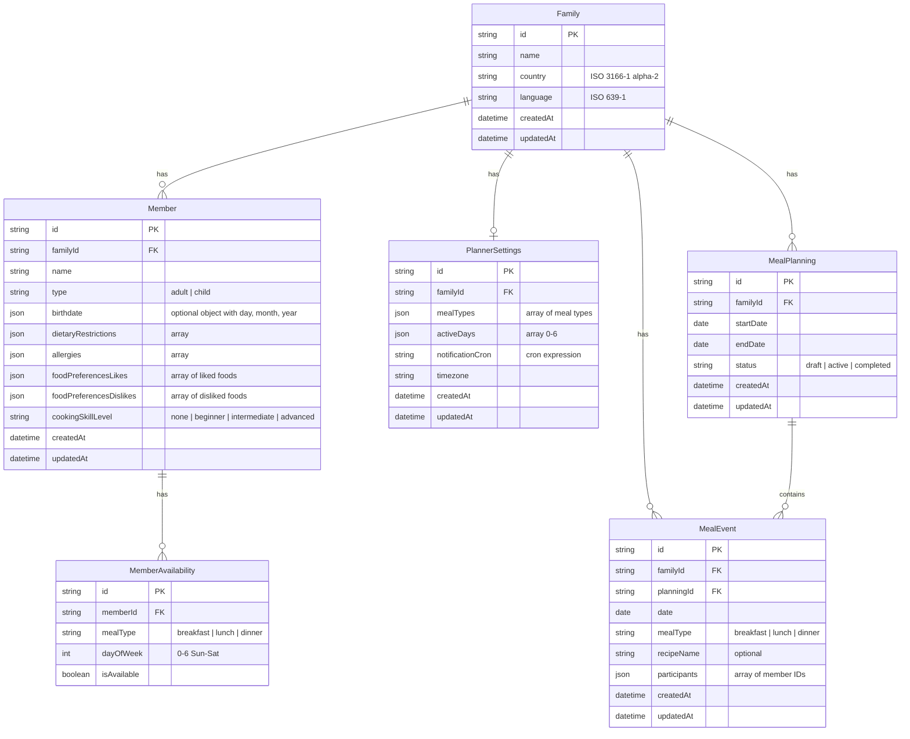

# Auguste - Database Schema

> [!NOTE]
> The database schema is defined and managed using **Drizzle ORM**. The source of truth for the schema is [schema.drizzle.ts](file:///home/nightbringer/Dev/auguste/packages/core/src/domain/db/schema.drizzle.ts).

## Entity Relationship Diagram



## SQLite Schema

```sql
-- Family table: Represents a household
CREATE TABLE Family (
    id TEXT PRIMARY KEY,
    name TEXT NOT NULL,
    country TEXT NOT NULL,  -- ISO 3166-1 alpha-2 (e.g., 'US', 'FR')
    language TEXT NOT NULL, -- ISO 639-1 (e.g., 'en', 'fr')
    createdAt TEXT NOT NULL DEFAULT (datetime('now')),
    updatedAt TEXT NOT NULL DEFAULT (datetime('now'))
);

-- Member table: Individual family members
CREATE TABLE Member (
    id TEXT PRIMARY KEY,
    familyId TEXT NOT NULL,
    name TEXT NOT NULL,
    type TEXT NOT NULL CHECK (type IN ('adult', 'child')),
    birthdate TEXT,
    dietaryRestrictions TEXT DEFAULT '[]',
    allergies TEXT DEFAULT '[]',
    foodPreferencesLikes TEXT NOT NULL DEFAULT '[]',
    foodPreferencesDislikes TEXT NOT NULL DEFAULT '[]',
    cookingSkillLevel TEXT DEFAULT 'none'
        CHECK (cookingSkillLevel IN ('none', 'beginner', 'intermediate', 'advanced')),
    createdAt TEXT NOT NULL DEFAULT (datetime('now')),
    updatedAt TEXT NOT NULL DEFAULT (datetime('now')),
    FOREIGN KEY (familyId) REFERENCES Family(id) ON DELETE CASCADE
);

-- MemberAvailability table: Which meals each member attends
CREATE TABLE MemberAvailability (
    id TEXT PRIMARY KEY,
    memberId TEXT NOT NULL,
    mealType TEXT NOT NULL CHECK (mealType IN ('breakfast', 'lunch', 'dinner')),
    dayOfWeek INTEGER NOT NULL CHECK (dayOfWeek >= 0 AND dayOfWeek <= 6),
    isAvailable INTEGER NOT NULL DEFAULT 1,
    FOREIGN KEY (memberId) REFERENCES Member(id) ON DELETE CASCADE,
    UNIQUE(memberId, mealType, dayOfWeek)
);

-- PlannerSettings table: Meal planning configuration
CREATE TABLE PlannerSettings (
    id TEXT PRIMARY KEY,
    familyId TEXT NOT NULL UNIQUE,
    mealTypes TEXT DEFAULT '["lunch", "dinner"]',
    activeDays TEXT DEFAULT '[0, 1, 2, 3, 4, 5, 6]',
    notificationCron TEXT DEFAULT '0 18 * * 0',
    timezone TEXT DEFAULT 'UTC',
    createdAt TEXT NOT NULL DEFAULT (datetime('now')),
    updatedAt TEXT NOT NULL DEFAULT (datetime('now')),
    FOREIGN KEY (familyId) REFERENCES Family(id) ON DELETE CASCADE
);

-- MealPlanning table: Weekly planning cycles
CREATE TABLE MealPlanning (
    id TEXT PRIMARY KEY,
    familyId TEXT NOT NULL,
    startDate TEXT NOT NULL, -- YYYY-MM-DD
    endDate TEXT NOT NULL,   -- YYYY-MM-DD
    status TEXT DEFAULT 'draft' CHECK (status IN ('draft', 'active', 'completed')),
    createdAt TEXT NOT NULL DEFAULT (datetime('now')),
    updatedAt TEXT NOT NULL DEFAULT (datetime('now')),
    FOREIGN KEY (familyId) REFERENCES Family(id) ON DELETE CASCADE
);

-- MealEvent table: Individual scheduled meals
CREATE TABLE MealEvent (
    id TEXT PRIMARY KEY,
    familyId TEXT NOT NULL,
    planningId TEXT, -- Optional, can exist outside a planning cycle
    date TEXT NOT NULL, -- YYYY-MM-DD
    mealType TEXT NOT NULL CHECK (mealType IN ('breakfast', 'lunch', 'dinner')),
    recipeName TEXT,
    participants TEXT DEFAULT '[]', -- JSON array of Member IDs
    createdAt TEXT NOT NULL DEFAULT (datetime('now')),
    updatedAt TEXT NOT NULL DEFAULT (datetime('now')),
    FOREIGN KEY (familyId) REFERENCES Family(id) ON DELETE CASCADE,
    FOREIGN KEY (planningId) REFERENCES MealPlanning(id) ON DELETE SET NULL
);

-- Indexes for performance
CREATE INDEX idx_member_familyId ON Member(familyId);
CREATE INDEX idx_availability_memberId ON MemberAvailability(memberId);
CREATE INDEX idx_settings_familyId ON PlannerSettings(familyId);
CREATE INDEX idx_planning_familyId ON MealPlanning(familyId);
CREATE INDEX idx_event_familyId ON MealEvent(familyId);
CREATE INDEX idx_event_planningId ON MealEvent(planningId);
CREATE INDEX idx_event_date ON MealEvent(date);
```

## Table Descriptions

### Family

The root entity representing a household. Each family can have multiple members and one planner settings configuration.

### Member

Individual people in the family. Stores dietary information, preferences, and cooking abilities.

### MemberAvailability

Tracks which meals each member will be present for on each day of the week. Used to calculate servings and customize meal plans.

### PlannerSettings

Global meal planning configuration for the family including schedule, notification preferences, and timezone.

### MealPlanning

Represents a specific week's meal plan status and duration.

### MealEvent

A specific meal instance (e.g., Lunch on Tuesday) containing the recipe, description, and list of participants.

## Schema Changes

### Birthdate Field (Updated)

The `Member.birthdate` field was changed from `age INTEGER` to `birthdate TEXT` to support flexible birthdate storage with optional day, month, and year components.

**Migration Note:** If you have an existing database with the `age` field, you'll need to:

1. Delete the existing database file (`.data/auguste.db`)
2. Run the application again to recreate the schema with the new `birthdate` field

The birthdate is stored as JSON with the following structure:

```json
{
  "day": 15, // optional: 1-31
  "month": 6, // optional: 1-12
  "year": 1990 // optional: 1900-2100
}
```

All fields are optional, allowing partial birthdate information (e.g., just year, or month and year).
