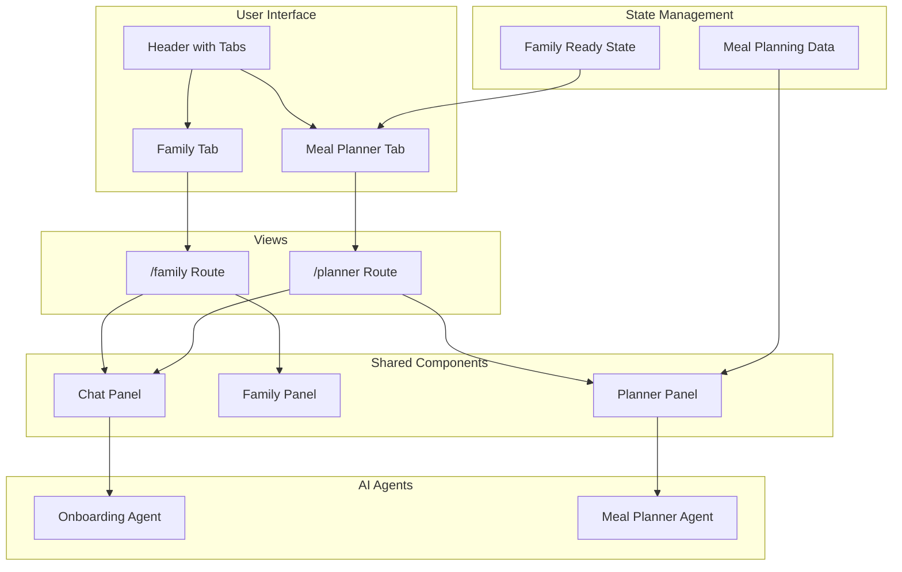

# Meal Planner Feature - Plan and Specifications

## Overview

This document outlines the implementation of the meal planner feature, which adds a second main view to the Auguste application alongside the existing family configuration view.

## Requirements Summary

- **Header Tabs**: "Family" and "Meal planner" tabs in the header
- **Family Readiness State**: Family is ready for meal planning when:
  - At least one member exists
  - `mealTypes` array has at least one value
  - `activeDays` array has at least one value
- **Navigation CTAs**:
  - "Go to Meal Planner" button when family is ready
  - "Edit Family" button to return to family configuration
- **Agent Consolidation**: Merge family-editor-agent into onboarding-agent (future refactor)
- **Routing**: TanStack Router 2 with routes `/family` (default) and `/planner`
- **Component Reuse**: Maximize reuse of existing components and layouts
- **Agent Integration**: Use meal-planner-agent for the meal planner view
- **Right Panel Display**: Show meal planning data based on MealPlanning and MealEvent models

## Architecture Overview



## Detailed Implementation Plan

### Phase 1: Infrastructure Setup

#### 1.1 Install and Configure TanStack Router

**Tasks:**

- Install `@tanstack/react-router` package
- Create router configuration in `apps/web/src/router/index.tsx`
- Update `main.tsx` to use router
- Create route structure:
  - `apps/web/src/routes/__root.tsx` - Root layout
  - `apps/web/src/routes/family.tsx` - Family configuration route (default)
  - `apps/web/src/routes/planner.tsx` - Meal planner route

**Technical Details:**

```typescript
// apps/web/src/router/index.tsx
import { createRouter, createRootRoute, createRoute } from '@tanstack/react-router';

const rootRoute = createRootRoute({
  component: RootLayout,
});

const familyRoute = createRoute({
  getParentRoute: () => rootRoute,
  path: '/family',
  component: FamilyView,
});

const plannerRoute = createRoute({
  getParentRoute: () => rootRoute,
  path: '/planner',
  component: PlannerView,
});

const router = createRouter({
  routeTree: rootRoute.addChildren([familyRoute, plannerRoute]),
});
```

#### 1.2 Update Header Component

**Tasks:**

- Modify [`header.tsx`](apps/web/src/components/layout/header.tsx) to include tab navigation
- Add state for active tab
- Implement tab switching logic with TanStack Router navigation
- Add "Go to Meal Planner" CTA when family is ready
- Add "Edit Family" CTA on planner tab

**Component Structure:**

```tsx
// apps/web/src/components/layout/header.tsx
interface HeaderProps {
  familyId?: string;
  isFamilyReady?: boolean;
  currentRoute: 'family' | 'planner';
}

export function Header({ familyId, isFamilyReady, currentRoute }: HeaderProps) {
  return (
    <header className="...">
      {/* Logo */}
      <div className="...">AUGUSTE</div>

      {/* Tab Navigation */}
      <nav className="...">
        <Link to="/family" className={currentRoute === 'family' ? 'active' : ''}>
          Family
        </Link>
        <Link
          to="/planner"
          className={currentRoute === 'planner' ? 'active' : ''}
          disabled={!isFamilyReady}
        >
          Meal Planner
        </Link>
      </nav>

      {/* CTAs */}
      {currentRoute === 'family' && isFamilyReady && (
        <Link to="/planner" className="cta-button">
          Go to Meal Planner
        </Link>
      )}
      {currentRoute === 'planner' && (
        <Link to="/family" className="cta-button">
          Edit Family
        </Link>
      )}
    </header>
  );
}
```

### Phase 2: Family Readiness Logic

#### 2.1 Create Family Readiness Hook

**Tasks:**

- Create [`apps/web/src/hooks/use-family-ready.ts`](apps/web/src/hooks/use-family-ready.ts)
- Implement logic to check family readiness:
  - At least one member exists
  - `mealTypes` array has at least one value
  - `activeDays` array has at least one value
- Return boolean `isReady` state

**Implementation:**

```typescript
// apps/web/src/hooks/use-family-ready.ts
import { useMemo } from 'react';
import { useFamilyData } from './use-family-data';

export function useFamilyReady(familyId: string) {
  const { members, settings } = useFamilyData(familyId);

  const isReady = useMemo(() => {
    // Check at least one member
    if (!members || members.length === 0) {
      return false;
    }

    // Check mealTypes has at least one value
    if (!settings || !settings.mealTypes || settings.mealTypes.length === 0) {
      return false;
    }

    // Check activeDays has at least one value
    if (!settings.activeDays || settings.activeDays.length === 0) {
      return false;
    }

    return true;
  }, [members, settings]);

  return { isReady };
}
```

#### 2.2 Integrate Readiness Check

**Tasks:**

- Update [`App.tsx`](apps/web/src/App.tsx) to use `useFamilyReady` hook
- Pass readiness state to Header component
- Use readiness state to enable/disable planner tab navigation

### Phase 3: Route Views

#### 3.1 Family Route (`/family`)

**Tasks:**

- Create [`apps/web/src/routes/family.tsx`](apps/web/src/routes/family.tsx)
- Reuse existing [`FamilyPanel`](apps/web/src/components/family/family-panel.tsx) component
- Reuse existing [`ChatPanel`](apps/web/src/components/chat/chat-panel.tsx) component
- Use onboarding-agent for chat interactions
- Maintain current layout (45% chat, 55% family panel)

**Component Structure:**

```tsx
// apps/web/src/routes/family.tsx
import { Header } from '@/components/layout/header';
import { ChatPanel } from '@/components/chat/chat-panel';
import { FamilyPanel } from '@/components/family/family-panel';
import { useChat } from '@/hooks/use-chat';
import { useFamilyReady } from '@/hooks/use-family-ready';

export function FamilyView() {
  const { familyId, messages, input, isLoading, ...chatProps } = useChat();
  const { isReady } = useFamilyReady(familyId);

  return (
    <div className="flex flex-col h-screen bg-[#FAF9F6]">
      <Header familyId={familyId} isFamilyReady={isReady} currentRoute="family" />
      <div className="flex flex-1 overflow-hidden">
        <div className="w-[45%] border-r border-escoffier-green/10">
          <ChatPanel {...chatProps} disabled={!familyId} />
        </div>
        <div className="w-[55%]">
          {familyId ? (
            <FamilyPanel familyId={familyId} isPolling={chatProps.isPolling} />
          ) : (
            <CreateFamilyModal onCreated={setFamilyId} />
          )}
        </div>
      </div>
    </div>
  );
}
```

#### 3.2 Planner Route (`/planner`)

**Tasks:**

- Create [`apps/web/src/routes/planner.tsx`](apps/web/src/routes/planner.tsx)
- Create new [`PlannerPanel`](apps/web/src/components/planner/planner-panel.tsx) component
- Reuse [`ChatPanel`](apps/web/src/components/chat/chat-panel.tsx) component
- Use meal-planner-agent for chat interactions
- Maintain same layout (45% chat, 55% planner panel)
- Display meal planning data based on MealPlanning and MealEvent models

**Component Structure:**

```tsx
// apps/web/src/routes/planner.tsx
import { Header } from '@/components/layout/header';
import { ChatPanel } from '@/components/chat/chat-panel';
import { PlannerPanel } from '@/components/planner/planner-panel';
import { useChat } from '@/hooks/use-chat';
import { useFamilyReady } from '@/hooks/use-family-ready';

export function PlannerView() {
  const { familyId, messages, input, isLoading, ...chatProps } = useChat();
  const { isReady } = useFamilyReady(familyId);

  // Redirect to family route if not ready
  if (!isReady) {
    return <Navigate to="/family" />;
  }

  return (
    <div className="flex flex-col h-screen bg-[#FAF9F6]">
      <Header familyId={familyId} isFamilyReady={isReady} currentRoute="planner" />
      <div className="flex flex-1 overflow-hidden">
        <div className="w-[45%] border-r border-escoffier-green/10">
          <ChatPanel {...chatProps} disabled={!familyId} />
        </div>
        <div className="w-[55%]">
          <PlannerPanel familyId={familyId} isPolling={chatProps.isPolling} />
        </div>
      </div>
    </div>
  );
}
```

### Phase 4: Planner Panel Component

#### 4.1 Create Planner Panel Structure

**Tasks:**

- Create [`apps/web/src/components/planner/planner-panel.tsx`](apps/web/src/components/planner/planner-panel.tsx)
- Implement tab-based layout similar to [`FamilyPanel`](apps/web/src/components/family/family-panel.tsx)
- Create tabs for:
  - "Weekly Plan" - Display 7-day meal plan
  - "Meal Details" - Detailed view of selected meal
  - "Calendar" - Calendar view of meals

**Component Structure:**

```tsx
// apps/web/src/components/planner/planner-panel.tsx
import { useState } from 'react';
import { WeeklyPlanView } from './weekly-plan-view';
import { MealDetailsView } from './meal-details-view';
import { CalendarView } from './calendar-view';
import { usePlannerData } from '@/hooks/use-planner-data';

type PlannerTabType = 'weekly' | 'details' | 'calendar';

interface PlannerPanelProps {
  familyId: string;
  isPolling?: boolean;
}

export function PlannerPanel({ familyId, isPolling = false }: PlannerPanelProps) {
  const [activeTab, setActiveTab] = useState<PlannerTabType>('weekly');
  const { planning, events, isLoading, error } = usePlannerData(familyId, { isPolling });

  const tabs: { id: PlannerTabType; label: string }[] = [
    { id: 'weekly', label: 'Weekly Plan' },
    { id: 'details', label: 'Meal Details' },
    { id: 'calendar', label: 'Calendar' },
  ];

  if (error) {
    return <ErrorView error={error} />;
  }

  return (
    <div className="flex flex-col h-full bg-white">
      {/* Tab Navigation */}
      <div className="flex-shrink-0 border-b border-escoffier-green/10">
        <div className="flex">
          {tabs.map((tab) => (
            <button
              key={tab.id}
              onClick={() => setActiveTab(tab.id)}
              className={activeTab === tab.id ? 'active' : 'inactive'}
            >
              {tab.label}
            </button>
          ))}
        </div>
      </div>

      {/* Tab Content */}
      <div className="flex-1 overflow-y-auto">
        {isLoading ? (
          <LoadingView />
        ) : (
          <>
            {activeTab === 'weekly' && <WeeklyPlanView planning={planning} events={events} />}
            {activeTab === 'details' && <MealDetailsView events={events} />}
            {activeTab === 'calendar' && <CalendarView events={events} />}
          </>
        )}
      </div>
    </div>
  );
}
```

#### 4.2 Create Planner Data Hook

**Tasks:**

- Create [`apps/web/src/hooks/use-planner-data.ts`](apps/web/src/hooks/use-planner-data.ts)
- Fetch meal planning data from API
- Include polling support for real-time updates
- Return planning and events data

**Implementation:**

```typescript
// apps/web/src/hooks/use-planner-data.ts
import { useQuery } from '@tanstack/react-query';
import { apiClient } from '@/lib/api-client';

interface UsePlannerDataOptions {
  isPolling?: boolean;
}

const POLLING_INTERVAL = 1000;

export function usePlannerData(familyId: string, options: UsePlannerDataOptions = {}) {
  const { isPolling = false } = options;
  const refetchInterval = isPolling ? POLLING_INTERVAL : false;

  const planningQuery = useQuery({
    queryKey: ['meal-planning', familyId],
    queryFn: () => apiClient.getMealPlanning(familyId),
    enabled: !!familyId,
    refetchInterval,
  });

  const eventsQuery = useQuery({
    queryKey: ['meal-events', familyId],
    queryFn: () => apiClient.getMealEvents(familyId),
    enabled: !!familyId,
    refetchInterval,
  });

  return {
    planning: planningQuery.data,
    events: eventsQuery.data,
    isLoading: planningQuery.isLoading || eventsQuery.isLoading,
    error: planningQuery.error || eventsQuery.error,
    refetch: () => {
      planningQuery.refetch();
      eventsQuery.refetch();
    },
  };
}
```

#### 4.3 Create Weekly Plan View

**Tasks:**

- Create [`apps/web/src/components/planner/weekly-plan-view.tsx`](apps/web/src/components/planner/weekly-plan-view.tsx)
- Display 7-day meal plan in grid or list format
- Show meal events grouped by day and meal type
- Include participant information
- Allow clicking on meals to view details

**Component Structure:**

```tsx
// apps/web/src/components/planner/weekly-plan-view.tsx
import { MealEvent } from '@auguste/core';
import { DayOfWeek, MealType } from '@auguste/core';

interface WeeklyPlanViewProps {
  planning?: MealPlanning | null;
  events?: MealEvent[];
}

export function WeeklyPlanView({ planning, events }: WeeklyPlanViewProps) {
  // Group events by day and meal type
  const groupedEvents = useMemo(() => {
    if (!events) return {};
    return events.reduce(
      (acc, event) => {
        const key = `${event.date}-${event.mealType}`;
        if (!acc[key]) acc[key] = [];
        acc[key].push(event);
        return acc;
      },
      {} as Record<string, MealEvent[]>,
    );
  }, [events]);

  // Render 7-day grid
  return (
    <div className="p-6">
      <h2 className="text-2xl font-serif text-escoffier-green mb-6">Weekly Meal Plan</h2>

      {/* Week date range */}
      {planning && (
        <p className="text-sm text-escoffier-green/60 mb-4">
          {formatDate(planning.startDate)} - {formatDate(planning.endDate)}
        </p>
      )}

      {/* 7-day grid */}
      <div className="grid grid-cols-7 gap-4">
        {daysOfWeek.map((day) => (
          <DayColumn key={day} day={day} events={groupedEvents[day] || []} />
        ))}
      </div>
    </div>
  );
}
```

#### 4.4 Create Meal Details View

**Tasks:**

- Create [`apps/web/src/components/planner/meal-details-view.tsx`](apps/web/src/components/planner/meal-details-view.tsx)
- Display detailed information about selected meal
- Show recipe name, description, participants
- Include meal type and date
- Allow editing meal details

#### 4.5 Create Calendar View

**Tasks:**

- Create [`apps/web/src/components/planner/calendar-view.tsx`](apps/web/src/components/planner/calendar-view.tsx)
- Display calendar view of meals
- Show meal events on calendar grid
- Allow navigation between weeks
- Click on day to view meals

### Phase 5: API Integration

#### 5.1 Extend API Client

**Tasks:**

- Update [`api-client.ts`](apps/web/src/lib/api-client.ts) to add meal planning endpoints
- Add methods:
  - `getMealPlanning(familyId: string)` - Get active meal planning
  - `getMealEvents(familyId: string)` - Get meal events for current week
  - `updateMealEvent(eventId: string, data)` - Update meal event

**Implementation:**

```typescript
// apps/web/src/lib/api-client.ts
export const apiClient = {
  // ... existing methods ...

  getMealPlanning: async (familyId: string) => {
    const response = await fetch(`${API_BASE_URL}/api/family/${familyId}/meal-planning`);
    if (!response.ok) throw new Error('Failed to fetch meal planning');
    return response.json();
  },

  getMealEvents: async (familyId: string) => {
    const response = await fetch(`${API_BASE_URL}/api/family/${familyId}/meal-events`);
    if (!response.ok) throw new Error('Failed to fetch meal events');
    return response.json();
  },

  updateMealEvent: async (
    eventId: string,
    data: { recipeName?: string; participants?: string[] },
  ) => {
    const response = await fetch(`${API_BASE_URL}/api/meal-events/${eventId}`, {
      method: 'PATCH',
      headers: { 'Content-Type': 'application/json' },
      body: JSON.stringify(data),
    });
    if (!response.ok) throw new Error('Failed to update meal event');
    return response.json();
  },
};
```

#### 5.2 Backend API Endpoints

**Tasks:**

- Create API endpoints in [`apps/api/src/index.ts`](apps/api/src/index.ts):
  - `GET /api/family/:familyId/meal-planning` - Get active meal planning
  - `GET /api/family/:familyId/meal-events` - Get meal events for current week
  - `PATCH /api/meal-events/:eventId` - Update meal event

**Implementation:**

```typescript
// apps/api/src/index.ts
import { getMealPlanning, getMealEvents, updateMealEvent } from '@auguste/core';

app.get('/api/family/:familyId/meal-planning', async (req, res) => {
  try {
    const { familyId } = req.params;
    const planning = await getMealPlanning({ familyId });
    res.json(planning);
  } catch (error) {
    res.status(500).json({ error: 'Failed to fetch meal planning' });
  }
});

app.get('/api/family/:familyId/meal-events', async (req, res) => {
  try {
    const { familyId } = req.params;
    const today = new Date().toISOString().split('T')[0];
    const nextWeek = new Date(Date.now() + 7 * 24 * 60 * 60 * 1000).toISOString().split('T')[0];
    const events = await getMealEvents({ familyId, startDate: today, endDate: nextWeek });
    res.json(events);
  } catch (error) {
    res.status(500).json({ error: 'Failed to fetch meal events' });
  }
});

app.patch('/api/meal-events/:eventId', async (req, res) => {
  try {
    const { eventId } = req.params;
    const { recipeName, participants } = req.body;
    const event = await updateMealEvent({ id: eventId, recipeName, participants });
    res.json(event);
  } catch (error) {
    res.status(500).json({ error: 'Failed to update meal event' });
  }
});
```

### Phase 6: Chat Integration

#### 6.1 Update Chat Hook for Planner Route

**Tasks:**

- Update [`useChat.ts`](apps/web/src/hooks/use-chat.ts) to support different agents based on route
- Use onboarding-agent on /family route
- Use meal-planner-agent on /planner route
- Pass agent type to API calls

**Implementation:**

```typescript
// apps/web/src/hooks/use-chat.ts
interface UseChatOptions {
  agentType?: 'onboarding' | 'meal-planner';
}

export function useChat(options: UseChatOptions = {}) {
  const { agentType = 'onboarding' } = options;

  // Use agentType to determine which agent to call
  const sendMessage = async (message: string) => {
    const response = await fetch(`${API_BASE_URL}/api/chat`, {
      method: 'POST',
      headers: { 'Content-Type': 'application/json' },
      body: JSON.stringify({
        message,
        familyId,
        agentType,
      }),
    });
    // ... handle response
  };

  // ... rest of hook
}
```

#### 6.2 Backend Agent Selection

**Tasks:**

- Update [`apps/api/src/index.ts`](apps/api/src/index.ts) to route to correct agent
- Select agent based on `agentType` parameter

**Implementation:**

```typescript
// apps/api/src/index.ts
import { onboardingAgent, mealPlannerAgent } from '@auguste/core';

app.post('/api/chat', async (req, res) => {
  try {
    const { message, familyId, agentType } = req.body;

    const agent = agentType === 'meal-planner' ? mealPlannerAgent : onboardingAgent;

    const response = await agent.generate({
      messages: [{ role: 'user', content: message }],
      requestContext: new Map([['familyId', familyId]]),
    });

    res.json({ message: response.text });
  } catch (error) {
    res.status(500).json({ error: 'Failed to process message' });
  }
});
```

### Phase 7: Styling and Polish

#### 7.1 Create Planner Styles

**Tasks:**

- Create [`apps/web/src/components/planner/planner-styles.css`](apps/web/src/components/planner/planner-styles.css)
- Apply consistent styling with family components
- Use existing color scheme:
  - `#1B3022` - Escoffier Green (dark)
  - `#D4AF37` - Champagne Gold
  - `#FAF9F6` - Off-white background

#### 7.2 Add Loading and Error States

**Tasks:**

- Create loading skeletons for planner views
- Create error states with retry buttons
- Ensure smooth transitions between states

#### 7.3 Responsive Design

**Tasks:**

- Ensure planner panel works on smaller screens
- Consider collapsible sidebar for mobile
- Test on different screen sizes

### Phase 8: Testing

#### 8.1 Unit Tests

**Tasks:**

- Test `useFamilyReady` hook
- Test `usePlannerData` hook
- Test planner panel components
- Test API client methods

#### 8.2 Integration Tests

**Tasks:**

- Test navigation between family and planner routes
- Test family readiness state transitions
- Test chat integration with meal-planner-agent
- Test API endpoints

#### 8.3 E2E Tests

**Tasks:**

- Test complete flow from family setup to meal planning
- Test meal plan creation and modification
- Test navigation and state management

## Data Models

### MealPlanning

```typescript
interface MealPlanning {
  id: string;
  familyId: string;
  startDate: string; // YYYY-MM-DD
  endDate: string; // YYYY-MM-DD
  status: 'draft' | 'active' | 'completed';
  createdAt: string;
  updatedAt: string;
}
```

### MealEvent

```typescript
interface MealEvent {
  id: string;
  familyId: string;
  planningId?: string;
  date: string; // YYYY-MM-DD
  mealType: 'breakfast' | 'lunch' | 'dinner';
  recipeName?: string;
  description?: string;
  participants: string[]; // Member IDs
  createdAt: string;
  updatedAt: string;
}
```

## Component Hierarchy

```
App (Router)
├── __root (RootLayout)
│   └── Header
├── /family (FamilyView)
│   ├── ChatPanel (onboarding-agent)
│   └── FamilyPanel
│       ├── FamilyOverview
│       ├── MembersList
│       ├── AvailabilityView
│       └── PlannerSettings
└── /planner (PlannerView)
    ├── ChatPanel (meal-planner-agent)
    └── PlannerPanel
        ├── WeeklyPlanView
        ├── MealDetailsView
        └── CalendarView
```

## File Structure

```
apps/web/src/
├── router/
│   └── index.tsx                    # TanStack Router configuration
├── routes/
│   ├── __root.tsx                    # Root layout
│   ├── family.tsx                    # Family route view
│   └── planner.tsx                   # Planner route view
├── components/
│   ├── layout/
│   │   └── header.tsx                # Updated with tabs and CTAs
│   ├── planner/
│   │   ├── planner-panel.tsx         # Main planner panel
│   │   ├── weekly-plan-view.tsx      # 7-day meal plan view
│   │   ├── meal-details-view.tsx     # Meal details view
│   │   ├── calendar-view.tsx         # Calendar view
│   │   └── planner-styles.css       # Planner styles
│   └── chat/
│       └── chat-panel.tsx            # Reused for both routes
├── hooks/
│   ├── use-family-ready.ts           # Family readiness check
│   ├── use-planner-data.ts           # Planner data fetching
│   └── use-chat.ts                   # Updated for agent selection
└── lib/
    └── api-client.ts                 # Extended with meal planning endpoints
```

## Future Refactor: Agent Consolidation

**Note:** This is a future task, not part of the current implementation.

Merge [`family-editor-agent.ts`](packages/core/src/ai/agents/family-editor-agent.ts) into [`onboarding-agent.ts`](packages/core/src/ai/agents/onboarding-agent.ts):

**Tasks:**

- Combine instructions from both agents
- Merge tool sets
- Update prompts to handle both onboarding and editing scenarios
- Add context awareness to determine mode (onboarding vs editing)
- Update all references to use consolidated agent
- Remove [`family-editor-agent.ts`](packages/core/src/ai/agents/family-editor-agent.ts)

## Success Criteria

1. ✅ Header displays "Family" and "Meal planner" tabs
2. ✅ "Meal planner" tab is disabled until family is ready
3. ✅ Family readiness is correctly determined (members + mealTypes + activeDays)
4. ✅ "Go to Meal Planner" CTA appears when family is ready
5. ✅ "Edit Family" CTA appears on planner tab
6. ✅ Navigation between `/family` and `/planner` routes works correctly
7. ✅ Planner panel displays meal planning data correctly
8. ✅ Chat integration works with meal-planner-agent
9. ✅ Components are reused where possible
10. ✅ Styling is consistent with existing design

## Open Questions

1. Should the planner route redirect to family route if family is not ready, or show a disabled state?
   - **Decision:** Redirect to family route with a message

2. Should meal plan creation be automatic when entering planner route, or require user initiation?
   - **Decision:** Require user initiation via chat with meal-planner-agent

3. Should the planner panel show historical meal plans or only current/active plans?
   - **Decision:** Show current/active plans only for MVP

4. Should users be able to edit meal events directly in the UI, or only through chat?
   - **Decision:** Both - allow direct UI editing and chat-based modifications
